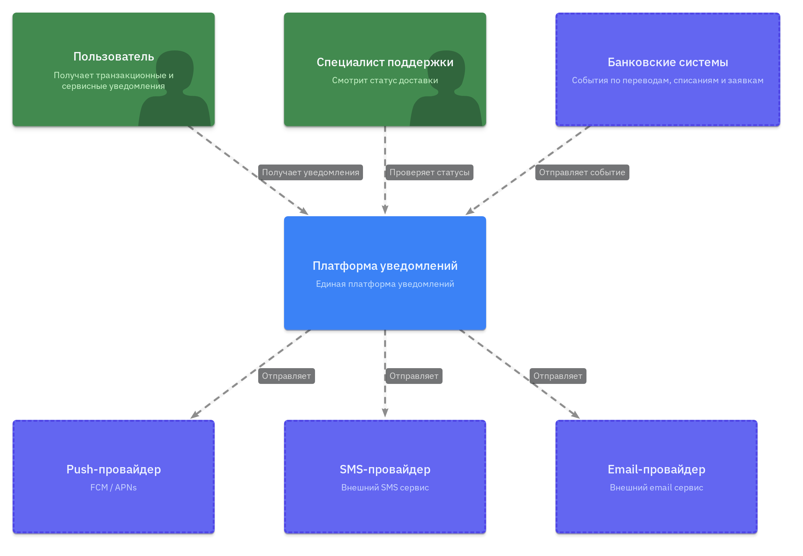
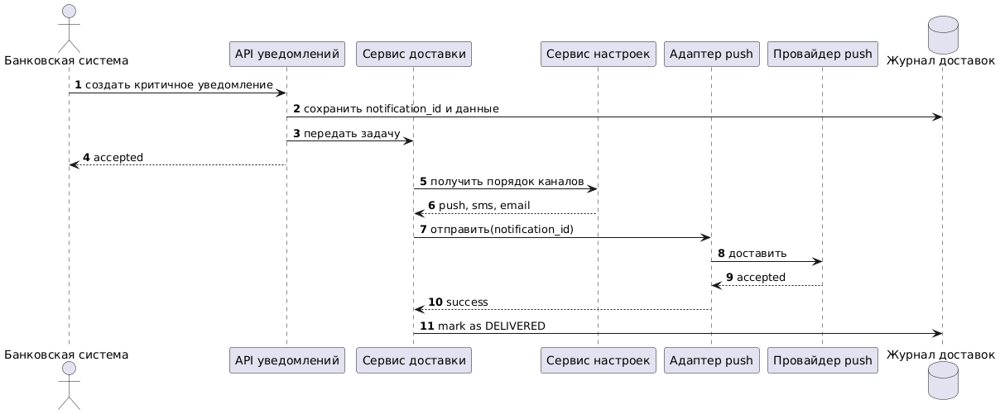
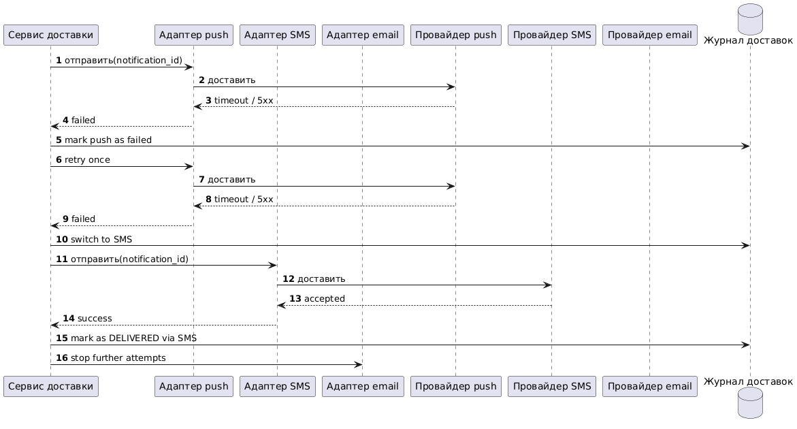
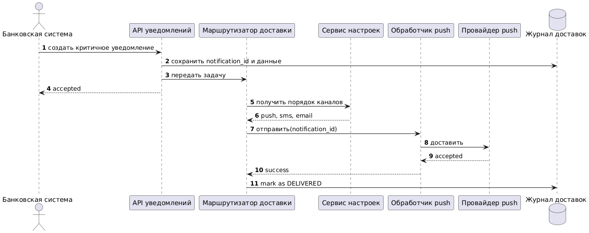
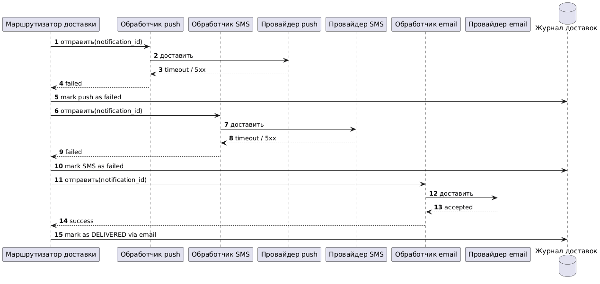

# RFC: Гарантированная доставка критичных уведомлений с переключением на резервный канал

| Метаданные | Значение |
|------------|----------|
| **Статус** | DESIGN |
| **Автор(ы)** | Андрей Кривощёков |
| **Ответственный** | Команда платформы |
| **Бизнес-заказчик** | Банк |
| **Ревьюеры** | Архитектор, SRE, ИБ |
| **Дата создания** | 2026-04-07 |
| **Дата обновления** | 2026-04-07 |

---

## Сокращения

| Сокращение | Значение |
|---|---|
| MAU | месячная активная аудитория |
| DAU | дневная активная аудитория |
| ASR | архитектурно значимые требования |
| SLA | целевой уровень сервиса |
| RPO | допустимая потеря данных при сбое |
| RTO | допустимое время восстановления |

---

## Оглавление

1. [Контекст](#контекст)
2. [Продуктовый анализ](#продуктовый-анализ)
3. [Пользовательские сценарии](#пользовательские-сценарии)
4. [Статистика](#статистика)
5. [Требования](#требования)
6. [Варианты решения](#варианты-решения)
7. [Сравнительный анализ](#сравнительный-анализ)
8. [Выводы](#выводы)
9. [Связанные задачи](#связанные-задачи)

---

## Контекст

В этой части я рассматриваю только критичные уведомления: подтверждение перевода, списание средств и похожие события. Для них важнее всего не потерять сообщение, не задвоить его и быстро переключиться на резервный канал, если основной не отвечает.

### Ключевые вопросы

- Что считается успешной доставкой критичного уведомления?
- Когда переключаться на резервный канал?
- Как не допустить повторной доставки одного и того же события?

---

## Продуктовый анализ

Что мы хотим получить:

- повысить retention пользователей на 15%;
- снизить количество жалоб на уведомления на 30%;
- меньше жалоб на пропавшие и повторяющиеся уведомления;
- более предсказуемую доставку критичных сообщений;
- единые правила для всех команд банка;
- прозрачный статус доставки для поддержки и аудита;
- контроль стоимости, чтобы не слать дорогие каналы без необходимости.

Что не входит в RFC:

- маркетинговые рассылки;
- массовые кампании;
- смена общей платформы уведомлений целиком.

---

## Пользовательские сценарии

| Приоритет | Тип сценария | Действующее лицо | Сценарий |
|-----------|--------------|------------------|----------|
| Обязательно | Критичный | Банковская система | После успешного перевода система создает критичное уведомление. |
| Обязательно | Критичный | Платформа уведомлений | Если push не сработал, система переключается на SMS, а потом на email. |
| Обязательно | Пользовательский | Пользователь банка | Пользователь выбирает предпочтительный канал и отключает маркетинговые уведомления. |
| Желательно | Операционный | Специалист поддержки | Специалист поддержки видит статус доставки и историю попыток. |

---

## Статистика

Исходные данные:

- `MAU = 10 млн`
- `DAU = 3 млн`
- уведомлений на пользователя в день = `10`

Базовая нагрузка:

- `3 000 000 × 10 = 30 000 000 уведомлений/день`
- средняя нагрузка = `30 000 000 / 86 400 ≈ 347 уведомлений/с`

Разбивка по типам:

- транзакционные: `6 000 000/день`, около `69/с`
- сервисные: `9 000 000/день`, около `104/с`
- маркетинговые: `15 000 000/день`, около `174/с`

Пик:

- кампания на `1 000 000` пользователей за `15 мин` дает около `1 111 уведомлений/с`
- с учетом повторных попыток и переключения каналов разумно закладывать `5 000+` попыток в секунду

Хранение:

- `30 млн` записей в день;
- при среднем размере записи `500 B` это около `15 GB` в день;
- при хранении `90` дней это примерно `1.35 TB` сырых данных.

---

## Требования

### Функциональные требования

| № | Приоритет | Обозначение | Требование |
|---|---|---|---|
| 1 | Обязательно | FR1 | Система принимает критичное уведомление и сохраняет его перед отправкой. |
| 2 | Обязательно | FR2 | Система доставляет критичное уведомление хотя бы по одному каналу. |
| 3 | Обязательно | FR3 | При сбое основного канала система переключается на резервный канал. |
| 4 | Обязательно | FR4 | Одно и то же критичное уведомление не должно приходить пользователю дважды. |
| 5 | Обязательно | FR5 | Система учитывает предпочтительный канал пользователя и правила отключения маркетинговых уведомлений. |
| 6 | Желательно | FR6 | Специалист поддержки может посмотреть статус и историю попыток доставки. |

### Нефункциональные требования

| № | Тип | Приоритет | Требование |
|---|---|---|---|
| 1 | Производительность | Обязательно | Критичное уведомление должно быть передано внешнему провайдеру за `p95 <= 2 c`, `p99 <= 5 c`. |
| 2 | Масштабируемость | Обязательно | Система должна выдерживать около `350 уведомлений/с` в среднем и не менее `5 000 уведомлений/с` на пике. |
| 3 | Надёжность и доступность | Обязательно | Доступность критичного пути доставки должна быть не ниже `99.95%` в месяц, `RPO = 0`, `RTO <= 15 мин`. |
| 4 | Наблюдаемость | Обязательно | Для каждого критичного уведомления должны быть логи, метрики, трассировка и журнал попыток доставки. |
| 5 | Безопасность | Обязательно | Передача данных должна идти по TLS, данные на диске должны быть зашифрованы, доступ к персональным данным должен быть ограничен. |
| 6 | Управляемость | Желательно | Изменения пользовательских настроек должны применяться к новым отправкам не позднее чем через `60 с`. |

### Архитектурно значимые требования

| № | Приоритет | ASR | Связанные требования |
|---|---|---|---|
| 1 | Критичный | Гарантировать доставку критичного уведомления хотя бы через один канал без видимых дублей. | FR2, FR3, FR4, NFR1, NFR3, NFR4 |
| 2 | Критичный | Обеспечить низкую задержку доставки критичных уведомлений. | FR1, FR2, NFR1, NFR3 |
| 3 | Высокий | Переживать пики нагрузки и временную недоступность внешних провайдеров. | FR5, NFR2, NFR3, NFR6 |

### Почему это влияет на архитектуру

- Для **ASR1** нужен журнал доставок, защита от повторной обработки и понятное состояние уведомления.
- Для **ASR2** нужен короткий путь от приема события до отправки в канал, без долгих синхронных вызовов наружу.
- Для **ASR3** нужны очередь сообщений, отдельные обработчики по каналам и ограничение числа повторных попыток.

---

## Варианты решения

### Вариант 1: Единый сервис доставки и одна очередь

> **Описание:** платформа принимает событие, кладет его в очередь, а единый сервис доставки последовательно пробует каналы по заданному порядку. После каждой попытки он пишет статус в журнал доставок.

#### Контейнерная схема C4

- Схема: [diagrams/variant-1/container.c4](./diagrams/variant-1/container.c4)

#### Диаграмма последовательностей: основной сценарий

- Файл: [diagrams/variant-1/main-sequence.puml](./diagrams/variant-1/main-sequence.puml)

#### Диаграмма последовательностей: переключение на резервный канал

- Файл: [diagrams/variant-1/failover-sequence.puml](./diagrams/variant-1/failover-sequence.puml)

#### Как вариант закрывает ASR

| ASR | Как закрывается |
|---|---|
| ASR1 | Журнал доставок хранит статус и id уведомления, а сервис доставки останавливает попытки после первого успешного канала. |
| ASR2 | Прием события и отправка в очередь короткие, а внешние вызовы происходят только внутри сервиса доставки. |
| ASR3 | Очередь разгружает входящий поток, а повторные попытки не блокируют прием новых уведомлений. |

#### Технологии

- `Java` / `Spring Boot` для сервисов;
- `RabbitMQ` как очередь сообщений;
- `PostgreSQL` для журнала доставок;
- `Redis` для быстрых настроек пользователя;
- `FCM/APNs`, `Twilio/Infobip`, `SendGrid/SES` как внешние провайдеры;
- `Prometheus` и `Grafana` для метрик.

#### Этапы реализации

| Этап | Описание | Планируемый срок | Ресурсы | Риски |
|------|----------|------------------|---------|-------|
| 1 | Сделать прием уведомлений, журнал доставок и отправку через push с резервом на SMS. | 2-3 недели | 2 backend, 1 QA, 1 DevOps | Ошибка в порядке переключения каналов. |
| 2 | Добавить email как последний резерв, экран статусов и алерты. | 1-2 недели | 1 backend, 1 QA, 1 SRE | Слишком много повторных попыток при сбоях провайдера. |

#### Преимущества

- проще всего понять и поддерживать;
- меньше компонентов;
- легче объяснить на защите;
- хорошо подходит как базовый вариант.

#### Недостатки

- единый сервис может стать узким местом;
- при росте нагрузки его придется аккуратно масштабировать;
- сложнее разделять нагрузку по каналам.

---

### Вариант 2: Маршрутизатор и отдельные очереди по каналам

> **Описание:** платформа принимает событие, маршрутизатор решает, какой канал пробовать первым, а дальше кладет задачи в отдельные очереди для push, SMS и email. Каждый канал обслуживает свой обработчик.

#### Контейнерная схема C4

- Схема: [diagrams/variant-2/container.likec4](./diagrams/variant-2/container.likec4)

#### Диаграмма последовательностей: основной сценарий

- Файл: [diagrams/variant-2/main-sequence.puml](./diagrams/variant-2/main-sequence.puml)

#### Диаграмма последовательностей: переключение на резервный канал

- Файл: [diagrams/variant-2/failover-sequence.puml](./diagrams/variant-2/failover-sequence.puml)

#### Как вариант закрывает ASR

| ASR | Как закрывается |
|---|---|
| ASR1 | Журнал доставок есть, а маршрутизатор не дает повторно отправить уже доставленное уведомление. |
| ASR2 | Прием события остается коротким, а выбор канала выносится в отдельный сервис. |
| ASR3 | Отдельные очереди и обработчики проще масштабировать независимо друг от друга. |

#### Технологии

- `Java` / `Spring Boot` для сервисов;
- `RabbitMQ` как брокер сообщений;
- `PostgreSQL` для журнала доставок;
- `Redis` для настроек пользователя;
- `FCM/APNs`, `Twilio/Infobip`, `SendGrid/SES` как внешние провайдеры;
- `Prometheus` и `Grafana` для метрик.

#### Этапы реализации

| Этап | Описание | Планируемый срок | Ресурсы | Риски |
|------|----------|------------------|---------|-------|
| 1 | Сделать маршрутизатор и отдельные очереди для push, SMS и email. | 3-4 недели | 3 backend, 1 QA, 1 DevOps | Больше мест, где можно ошибиться в логике. |
| 2 | Добавить независимое масштабирование каналов и ручную переотправку из журнала доставок. | 2 недели | 1 backend, 1 SRE | Сложнее поддерживать и проверять. |

#### Преимущества

- легче масштабировать каждый канал отдельно;
- проще выделять проблемный канал;
- удобнее, если трафик по каналам сильно разный.

#### Недостатки

- больше компонентов;
- больше точек отказа;
- сложнее отлаживать переключение между каналами;
- выше операционная нагрузка.

---

## Сравнительный анализ

### Ресурсные требования

| Критерий | Вариант 1 | Вариант 2 |
|----------|-----------|-----------|
| Время до первого запуска | 3-4 недели | 5-6 недель |
| Команда | 2 backend, 1 QA, 1 DevOps | 3 backend, 1 QA, 1 DevOps |
| Инфраструктура | одна очередь, одна база, один сервис доставки | маршрутизатор, три очереди, три обработчика |
| Операционный риск | Ниже | Выше |
| Поддержка | Проще | Сложнее |

### Соответствие требованиям

| Требование | Вариант 1 | Вариант 2 |
|------------|-----------|-----------|
| FR1 | ✅ Да | ✅ Да |
| FR2 | ✅ Да | ✅ Да |
| FR3 | ✅ Да | ✅ Да |
| FR4 | ✅ Да | ✅ Да |
| NFR1 | ✅ Да | ✅ Да |
| NFR2 | ✅ Да | ✅ Да |
| NFR3 | ✅ Да | ✅ Да |
| NFR4 | ✅ Да | ✅ Да |

---

## Выводы

**Рекомендация:** выбрать **Вариант 1 - единый сервис доставки и одна очередь**.

Почему:

- он проще;
- его легче объяснить и защитить;
- в нем меньше компонентов и меньше мест для ошибок;
- он уже закрывает все ключевые требования задания.

Компромиссы:

- единый сервис придется масштабировать;
- для очень разной нагрузки по каналам вариант 2 удобнее;
- если в будущем трафик сильно вырастет, архитектуру можно будет усложнить.

---

## Связанные задачи

- описать формат события уведомления;
- зафиксировать порядок каналов по умолчанию;
- согласовать список уведомлений, которые нельзя отключить;
- сделать экран статусов для поддержки;
- настроить алерты по сбоям провайдеров;
- провести тесты на отказ push, SMS и email.

## Приложения

### Глоссарий

| Термин | Определение |
|--------|-------------|
| Notification Platform | Централизованная платформа, через которую проходят все уведомления банка. |
| Failover | Автоматическое переключение на резервный канал при сбое основного. |
| Дедупликация | Исключение повторной доставки одного и того же уведомления. |
| Журнал доставок | Хранилище статусов, попыток и финального результата доставки. |
